# Hi there, I'm Shaurya 👋
- 🔭 I’m currently working as GenAI backend developer (AEH level-11) at Accenture
- 🌱 Learning new Generative AI use-cases everyday
- 📈 Expanding my knowledge in backend with API development
- 📫 Reach me at: shauryachichra@gmail.com

## 🚀 Skills
- Python | MongoDB | FastAPI
- LLMs | RAG | Vector DBs | Langchain
- GitHub | Cloud | Docker | Render

## 📈 GitHub Stats
#### Personal email

#### Work email (Hard-coded stats😅..)

## 🔗 Connect with me

